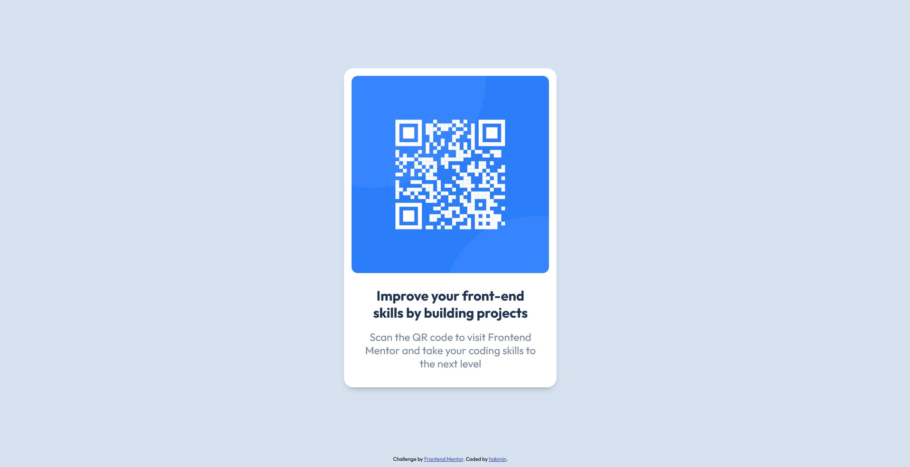

     

*Desktop (left) and Mobile (right) Views*

<h1 align="center">Frontend Mentor - QR code component solution</h1>

    <h2><a href="https://habmin.github.io/frontend-mentor-qr-code/">Live Link</a> | <a href="https://www.frontendmentor.io/solutions/intro-to-frontend-mentor-qr-code-component-zzYE_QxfFZ">Solution Link</a></h2>

 

## Table of contents

- [Overview](#overview)
  - [Links](#links)
- [My process](#my-process)
  - [Built with](#built-with)
  - [What I learned](#what-i-learned)
  - [Continued development](#continued-development)
- [Author](#author)

## Overview

This is a solution to the [QR code component challenge on Frontend Mentor](https://www.frontendmentor.io/challenges/qr-code-component-iux_sIO_H). A simple intro task of creating an element that contains a QR code with some text, centered inside the window.

### Links

- Solution URL: [Frontend Mentor](https://www.frontendmentor.io/solutions/intro-to-frontend-mentor-qr-code-component-zzYE_QxfFZ)
- Live Site URL: [GitHub Pages](https://habmin.github.io/frontend-mentor-qr-code/)

## My process

Been awhile since I messed around with pure HTML/CSS, it was fairly easy to create the element to the design first, but making sure the sizing was good from desktop and mobile views took some time. Started with the elements, then styled them to their proper colors, and then spent a fair amount of time sizing them in the different views. 

### Built with

- Semantic HTML5 markup
- CSS custom properties
- Flexbox

### What I learned

Learned about `object-fit`, though not sure how much browser support it has. Also learned more about `rem` and `em` sizing, though still need more pratice/understanding of it. Also got more practice with `vh`/`vw`. 

### Continued development

What I couldn't seem to get to work was scaling the QR code image when rezising the window from the *vertical* axis. I was testing to work with a 1280 x 720 resolution, and I couldn't get the element to resize to prevent overflow/scrollbar showing up. When playing around the div container and QR image, the image would always overflow the parent div container, dispite whatever I tried. Was able to scale when resizing the window's width however, which made mobile view possible.

### Author

- Henry Andrew Baum (habmin)
